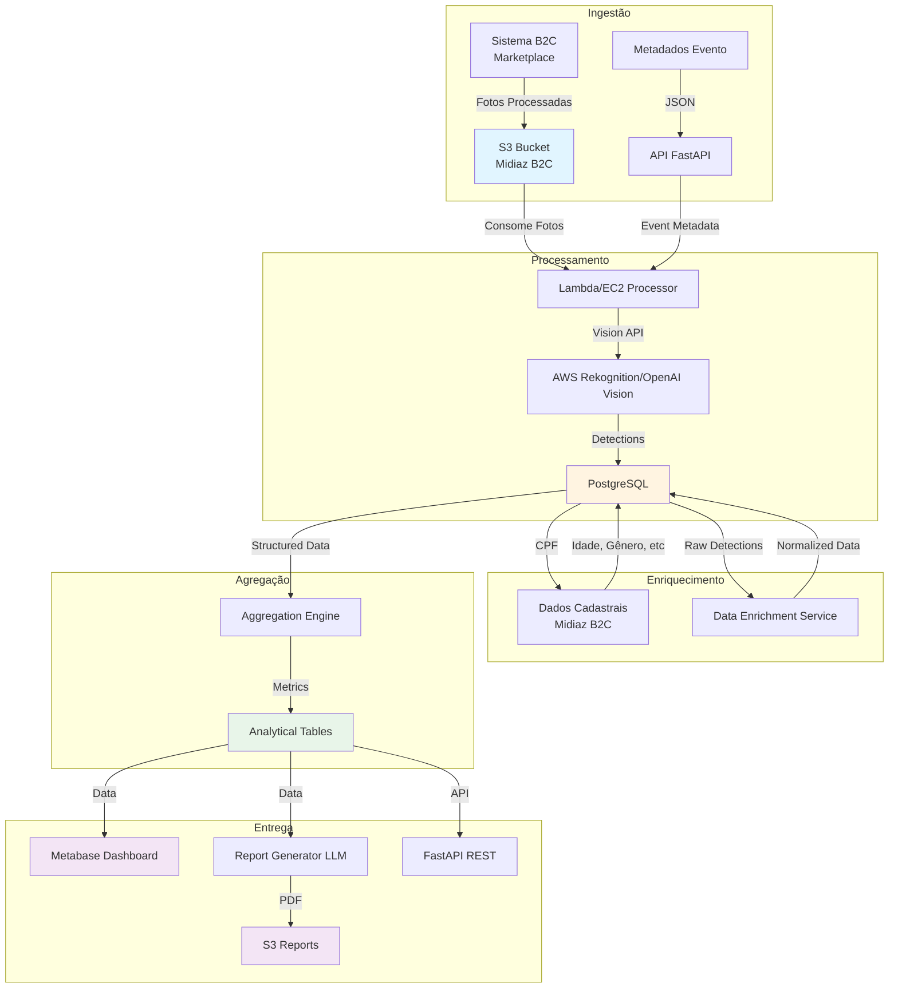
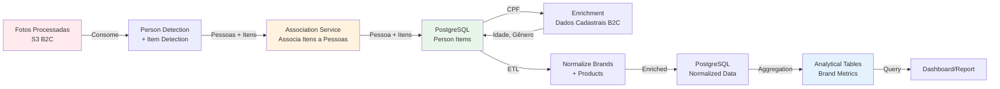
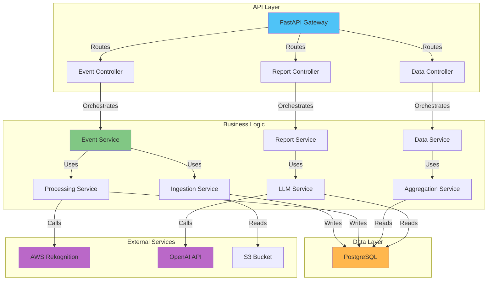
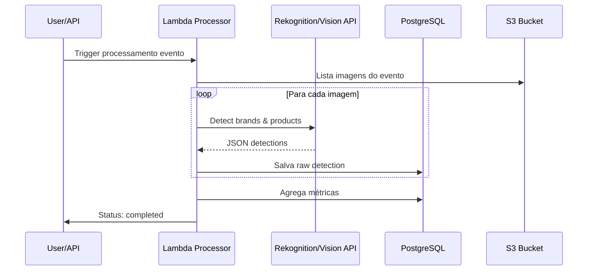

# 📋 Plano Técnico Completo - Event Brand Report MVP
## Midiaz B2B - Inteligência Visual para Marketing Esportivo

**Versão:** 1.0  
**Data:** 2025  
**Status:** MVP - Fase de Produção  
**Equipe:** Matheus Augusto (Líder Técnico), Luís Felipe Pascoal (Cientista de Dados), Rafaela Leão (Designer de Produto)

---

## 1. Resumo Executivo do MVP

### 1.1. Visão Geral do Produto

O **Event Brand Report** é o **MVP e primeiro produto** do Midiaz B2B, transformando fotos esportivas já processadas e armazenadas no S3 (pelo sistema B2C - marketplace) em insights estruturados sobre presença de marca em eventos esportivos. O MVP foca em processar um evento completo (ex.: Maratona do Recife) e entregar um relatório executivo que responde a três perguntas fundamentais:

1. **Quais marcas aparecem mais no evento?**
2. **Quais produtos são mais usados pelos atletas?**
3. **Qual é o share de mercado visual de cada marca?**

**Fonte de Dados:** O sistema consome fotos que já foram processadas e estão armazenadas no S3 pelo sistema Midiaz B2C (marketplace). Quando uma pessoa está cadastrada na Midiaz, temos acesso a dados cadastrais como CPF, idade, gênero, entre outros, que podem ser utilizados para enriquecimento dos dados.

### 1.2. Principais Entregáveis

| Entregável | Descrição | Formato |
|------------|-----------|---------|
| **Pipeline de Processamento** | Sistema end-to-end que processa fotos e extrai dados | Código Python + Infraestrutura |
| **Dataset Analítico** | Tabelas estruturadas com métricas de presença de marca | PostgreSQL + CSV/Parquet |
| **Relatório Executivo** | Documento PDF com insights em linguagem natural | PDF gerado via LLM |
| **Dashboard Interativo** | Visualizações exploratórias dos dados | Metabase (recomendado) |
| **API de Consulta** | Endpoints REST para acessar dados agregados | FastAPI |

### 1.3. Motivação de Negócio

**Problema:** Marcas esportivas investem milhões em patrocínios sem ter dados confiáveis sobre presença real de seus produtos em eventos. Pesquisas declarativas são imprecisas e caras.

**Solução MVP:** Automatizar a extração de dados visuais de eventos esportivos, transformando fotos em métricas objetivas de presença de marca, permitindo:
- Medição precisa de ROI de patrocínios
- Identificação de oportunidades de ativação
- Benchmarking competitivo em tempo real
- Decisões baseadas em evidências visuais

**Valor Proposto:** Reduzir o tempo de análise de semanas para horas, com precisão superior a pesquisas tradicionais.

### 1.4. Stakeholders

| Stakeholder | Interesse |
|-------------|-----------|
| **Organizadores de Eventos** | Validar atratividade para patrocinadores através de dados de presença de marca |
| **Marcas Patrocinadoras** | Medir ROI e eficácia de ativações com métricas objetivas |
| **Midiaz (Interno)** | Validar proposta de valor B2B e criar case de sucesso |

**Nota:** Os entregáveis variam caso a caso, podendo incluir relatórios PDF, dashboards interativos, APIs de dados ou datasets exportáveis, dependendo das necessidades específicas de cada stakeholder.

### 1.5. Escopo do MVP - Dentro e Fora

#### ✅ **DENTRO DO MVP**

1. **Processamento de 1 evento completo**
   - Ingestão de fotos já processadas e armazenadas no S3 (sistema B2C)
   - Processamento batch (não real-time)
   - Suporte a 5-10 marcas principais (Nike, Adidas, Mizuno, Track&Field, etc.)
   - Enriquecimento com dados cadastrais quando pessoa está cadastrada na Midiaz (CPF, idade, gênero, etc.)

2. **Extração de dados básicos**
   - Detecção de marca (logotipo)
   - Categoria de produto (tênis, camiseta, boné, óculos)
   - Confiança do modelo (score)
   - Metadados do evento (nome, local, data)

3. **Métricas calculadas**
   - Share de marca (%)
   - Volume absoluto de aparições
   - Ranking de produtos
   - Total de atletas únicos identificados

4. **Entrega analítica**
   - Relatório PDF automatizado (100-200 palavras)
   - Dashboard com 4-6 visualizações principais
   - Dataset tabular exportável (CSV)

5. **Infraestrutura mínima**
   - Backend FastAPI
   - PostgreSQL para dados estruturados
   - S3 para armazenamento de imagens
   - Processamento via Lambda ou EC2

#### ❌ **FORA DO MVP (v2+)**

1. **Multi-evento e histórico**
   - Comparação entre eventos
   - Tendências temporais
   - Análise de recorrência de atletas

2. **Detecções avançadas**
   - Bounding boxes precisos
   - Detecção de idade/gênero
   - Classificação de nível de competição
   - Detecção de contexto (início/fim de prova)

3. **Produtos customizados**
   - API pública de dados
   - Integração com sistemas de CRM
   - Alertas e notificações automáticas

4. **Análise preditiva**
   - Previsão de presença de marca
   - Recomendações de ativação
   - ROI forecasting

5. **Escala enterprise**
   - Processamento real-time
   - Multi-tenant
   - SLA garantido

---

## 2. Arquitetura Completa da Solução

### 2.1. Visão Geral da Arquitetura



**Decisão Arquitetural:** Optamos por uma arquitetura **híbrida serverless + containerizada**:
- **Serverless (Lambda)** para processamento batch de imagens (custo-efetivo)
- **Containerizado (EC2/Fargate)** para serviços de longa duração (agregação, enriquecimento)
- **PostgreSQL** como fonte única de verdade (relacional para queries complexas)
- **S3** como data lake para imagens brutas e relatórios gerados

### 2.2. Arquitetura de Dados

#### 2.2.1. Fluxo de Dados End-to-End



#### 2.2.2. Camadas de Armazenamento

| Camada | Tecnologia | Propósito | Retenção |
|--------|------------|-----------|----------|
| **Raw Images** | S3 (Standard) | Fotos originais do evento | 90 dias |
| **Processed Images** | S3 (Standard-IA) | Imagens pré-processadas | 30 dias |
| **Raw Detections** | PostgreSQL | Resultados brutos da API de visão | Permanente |
| **Normalized Data** | PostgreSQL | Dados enriquecidos e validados | Permanente |
| **Analytical Tables** | PostgreSQL | Métricas agregadas por evento | Permanente |
| **Reports** | S3 (Standard) | PDFs gerados | 1 ano |

**Decisão:** Usar **PostgreSQL** em vez de DynamoDB porque:
- Queries analíticas complexas (JOINs, GROUP BY, window functions)
- Relacionamentos entre eventos, marcas, produtos
- Facilita criação de views materializadas
- Custo previsível (RDS t3.medium ~$70/mês)

#### 2.2.3. Catálogo de Dados

**Metadados do Evento (Event Metadata)**
```json
{
  "event_id": "uuid",
  "event_name": "Maratona do Recife 2025",
  "event_type": "corrida",
  "event_date": "2025-05-12",
  "event_location": "Recife, PE",
  "total_photos": 14532,
  "total_athletes_estimated": 8920,
  "photographer_ids": ["photographer_001", "photographer_002"],
  "status": "processing|completed|failed",
  "created_at": "2025-05-12T06:00:00Z",
  "processed_at": "2025-05-12T14:30:00Z"
}
```

**Metadados de Processamento**
- Versão do modelo de visão usado
- Timestamp de cada etapa
- Erros e retries
- Custo estimado de processamento

### 2.3. Arquitetura de Backend

#### 2.3.1. Serviços Principais



#### 2.3.2. Fila/Event-Driven (Opcional no MVP)

**Recomendação:** **NÃO usar fila no MVP**. Processamento síncrono via Lambda com timeout de 15 minutos é suficiente.

**Justificativa:**
- MVP processa 1 evento por vez
- Volume baixo (< 20k imagens/evento)
- Complexidade desnecessária para MVP
- Custo adicional (SQS, EventBridge)

**Para v2:** Implementar SQS + Step Functions quando houver multi-evento e processamento paralelo.

#### 2.3.3. Orquestração

**MVP:** Processamento sequencial simples
```
1. Ingestão → 2. Preprocessing → 3. Vision API → 4. Enrichment → 5. Aggregation → 6. Report Generation
```

**v2:** Step Functions para orquestração complexa com retry e error handling.

#### 2.3.4. API para Consulta (MVP)

**Endpoints Essenciais:**

```python
# Eventos
GET    /api/v1/events                    # Lista eventos
GET    /api/v1/events/{event_id}          # Detalhes do evento
POST   /api/v1/events                    # Cria novo evento
GET    /api/v1/events/{event_id}/status   # Status do processamento

# Relatórios
GET    /api/v1/events/{event_id}/report   # Gera/retorna relatório PDF
GET    /api/v1/events/{event_id}/summary  # Resumo JSON

# Dados Analíticos
GET    /api/v1/events/{event_id}/brands   # Lista marcas detectadas
GET    /api/v1/events/{event_id}/products # Lista produtos detectados
GET    /api/v1/events/{event_id}/metrics # Métricas agregadas
```

**Decisão:** FastAPI porque:
- Async nativo (melhor para I/O com APIs externas)
- Validação automática com Pydantic
- Documentação automática (Swagger)
- Fácil integração com serviços Python (pandas, SQLAlchemy)

### 2.4. Arquitetura de IA e Visão Computacional

#### 2.4.1. Modelo de Detecção de Marca

**Recomendação MVP: AWS Rekognition Custom Labels**

**Por quê?**
- ✅ Treinamento customizado com dataset de marcas esportivas
- ✅ Alta precisão para logotipos conhecidos (Nike, Adidas, etc.)
- ✅ Gerenciado pela AWS (sem infraestrutura própria)
- ✅ Custo: $1.00 por hora de treinamento + $4.00 por 1.000 imagens inferência

**Alternativa (se custo for limitante):** OpenAI Vision API
- ✅ Boa detecção zero-shot de marcas conhecidas
- ✅ Custo: $0.01-0.03 por imagem
- ❌ Menos preciso que modelo customizado
- ❌ Pode ter alucinações

**Estratégia Híbrida (Recomendada):**
1. **Fase 1 (MVP):** OpenAI Vision API para validação rápida
2. **Fase 2 (v1):** Treinar modelo customizado Rekognition com 500-1000 imagens anotadas
3. **Fase 3 (v2):** Fine-tuning contínuo com feedback loop

#### 2.4.2. Modelo de Detecção de Categoria de Produto

**Recomendação: OpenAI Vision API com Prompt Engineering**

**Prompt Estruturado:**
```
Analise esta imagem de evento esportivo e identifique:
1. Tipo de produto esportivo visível (tênis, camiseta, boné, óculos, short, meia)
2. Marca do produto (se identificável)
3. Confiança da detecção (alto/médio/baixo)

Retorne JSON:
{
  "products": [
    {
      "type": "tênis",
      "brand": "Nike",
      "confidence": "alto"
    }
  ]
}
```

**Por quê não modelo customizado?**
- Categorias são genéricas (tênis, camiseta) - não precisa de treinamento
- OpenAI Vision tem boa performance zero-shot
- Custo menor que treinar modelo próprio

#### 2.4.3. Modelo de Estimativa de Idade/Gênero (Opcional MVP)

**Status:** ❌ **FORA DO MVP**

**Justificativa:**
- Complexidade adicional sem valor imediato
- Questões éticas de privacidade
- Baixa precisão em imagens esportivas (distância, movimento)

**Para v2:** Implementar com AWS Rekognition Face Analysis (se necessário para segmentação demográfica).

#### 2.4.4. Estratégia de Inferência

**MVP: Processamento Batch Assíncrono**



**Configuração Lambda:**
- **Timeout:** 15 minutos (máximo AWS)
- **Memory:** 3GB (para processar múltiplas imagens em paralelo)
- **Concurrency:** 1 (evitar rate limits da API)
- **Retry:** 3 tentativas com backoff exponencial

**Otimização de Custo:**
- Processar imagens em batches de 10
- Cache de resultados (evitar reprocessar mesma imagem)
- Compressão de imagens antes do envio (reduz custo de API)

#### 2.4.5. Pipeline de Pré-processamento

**Etapas:**

1. **Validação de Imagem**
   - Formato suportado (JPEG, PNG)
   - Tamanho mínimo (100x100px)
   - Tamanho máximo (10MB)

2. **Normalização**
   - Redimensionar para 1024x1024px (mantém aspect ratio)
   - Compressão JPEG qualidade 85%
   - Conversão para RGB (remove alpha channel)

3. **Otimização para API**
   - Base64 encoding (se necessário)
   - Batch de 10 imagens por requisição

**Código Exemplo:**
```python
from PIL import Image
import io

def preprocess_image(image_bytes: bytes) -> bytes:
    img = Image.open(io.BytesIO(image_bytes))
    img = img.convert('RGB')
    img.thumbnail((1024, 1024), Image.Resampling.LANCZOS)
    
    output = io.BytesIO()
    img.save(output, format='JPEG', quality=85, optimize=True)
    return output.getvalue()
```

#### 2.4.6. Associação de Itens a Pessoas

**Problema Crítico:** Uma foto pode conter múltiplas pessoas, cada uma usando diferentes itens (tênis, camiseta, etc.). É fundamental garantir que os itens detectados sejam corretamente associados à pessoa que os está usando, evitando misturar itens de pessoas diferentes.

**Solução: Detecção de Pessoas + Associação por Proximidade Espacial**

**Processo:**
1. **Detectar Pessoas:** Usar API de visão para detectar pessoas na foto (bounding boxes)
2. **Detectar Itens:** Detectar marcas e produtos com seus bounding boxes
3. **Associar por Proximidade:** Para cada item, encontrar a pessoa mais próxima usando cálculo de distância entre bounding boxes
4. **Validar Associação:** Item deve estar dentro ou próximo do bounding box da pessoa (threshold configurável)
5. **Calcular Confiança:** `association_confidence` baseado na proximidade e sobreposição

**Algoritmo de Associação:**

```python
def associate_items_to_persons(photo_id, persons_detections, items_detections):
    """
    Associa itens detectados às pessoas corretas na foto.
    
    Args:
        persons_detections: Lista de detecções de pessoas com bounding boxes
        items_detections: Lista de detecções de itens (marcas/produtos) com bounding boxes
    
    Returns:
        Lista de associações pessoa-item com confiança
    """
    associations = []
    
    for item in items_detections:
        best_person = None
        best_distance = float('inf')
        best_overlap = 0
        
        for person in persons_detections:
            # Calcular distância entre centros dos bounding boxes
            distance = euclidean_distance(
                get_center(item.bbox),
                get_center(person.bbox)
            )
            
            # Calcular sobreposição (IoU - Intersection over Union)
            overlap = calculate_iou(item.bbox, person.bbox)
            
            # Verificar se item está dentro ou próximo da pessoa
            if is_item_near_person(item.bbox, person.bbox, threshold=50):
                # Priorizar sobreposição, depois distância
                if overlap > best_overlap or (overlap == best_overlap and distance < best_distance):
                    best_distance = distance
                    best_overlap = overlap
                    best_person = person
        
        if best_person:
            # Calcular confiança da associação
            association_confidence = calculate_association_confidence(
                item.bbox,
                best_person.bbox,
                best_distance,
                best_overlap
            )
            
            associations.append({
                'person_id': best_person.id,
                'item': item,
                'association_confidence': association_confidence,
                'distance': best_distance,
                'overlap': best_overlap
            })
        else:
            # Item não associado a nenhuma pessoa (pode ser item solto na foto)
            associations.append({
                'person_id': None,
                'item': item,
                'association_confidence': 0.0,
                'note': 'item_not_associated'
            })
    
    return associations

def calculate_association_confidence(item_bbox, person_bbox, distance, overlap):
    """
    Calcula confiança da associação baseado em:
    - Sobreposição (IoU): quanto maior, melhor
    - Distância: quanto menor, melhor
    """
    # Normalizar distância (assumindo imagem 1024x1024)
    normalized_distance = distance / 1448.0  # diagonal máxima
    
    # Fórmula: overlap tem peso 0.7, distância tem peso 0.3
    confidence = (overlap * 0.7) + ((1 - normalized_distance) * 0.3)
    
    return min(1.0, max(0.0, confidence))
```

**Requisitos Técnicos:**
- **Bounding boxes obrigatórios:** Tanto para pessoas quanto para itens
- **API de detecção de pessoas:** AWS Rekognition DetectFaces ou similar
- **Threshold de proximidade:** Configurável (padrão: 50 pixels)
- **Filtro de confiança:** Associações com `association_confidence < 0.5` podem ser descartadas

**Casos Especiais:**
- **Item não associado:** Se item não está próximo de nenhuma pessoa, pode ser descartado ou marcado como "não associado"
- **Múltiplos itens da mesma pessoa:** Uma pessoa pode ter múltiplos itens (tênis + camiseta + boné)
- **Item parcialmente visível:** Se apenas parte do item está visível, usar bounding box parcial

#### 2.4.7. Armazenamento de Resultados

**Estrutura no PostgreSQL:**

```sql
-- Tabela de detecções brutas
CREATE TABLE raw_detections (
    id UUID PRIMARY KEY DEFAULT gen_random_uuid(),
    event_id UUID NOT NULL REFERENCES events(id),
    photo_s3_key VARCHAR(500) NOT NULL,
    detection_type VARCHAR(50) NOT NULL, -- 'brand' ou 'product'
    detected_label VARCHAR(200),
    confidence_score DECIMAL(5,4),
    bounding_box JSONB, -- {x, y, width, height} - NULL no MVP
    raw_response JSONB, -- Resposta completa da API
    created_at TIMESTAMP DEFAULT NOW()
);

-- Índices para performance
CREATE INDEX idx_raw_detections_event ON raw_detections(event_id);
CREATE INDEX idx_raw_detections_type ON raw_detections(detection_type);
CREATE INDEX idx_raw_detections_label ON raw_detections(detected_label);
```

### 2.5. Arquitetura do Produto Analítico

#### 2.5.1. Decisão: Dashboard + Relatório PDF

**Recomendação:** **Ambos no MVP**

**Justificativa:**
- **Dashboard (Metabase):** Exploração interativa, drill-down, filtros
- **Relatório PDF:** Documento executivo para apresentações, email, impressão

**Custo:** Metabase Open Source (self-hosted) = $0 | Metabase Cloud = $85/mês

#### 2.5.2. Dashboard - Metabase (Recomendado)

**Por quê Metabase?**
- ✅ Open source (sem custo no MVP)
- ✅ Fácil conexão com PostgreSQL
- ✅ Interface intuitiva (não precisa de SQL avançado)
- ✅ Embedding possível (para v2)
- ✅ Suporte a exportação (CSV, PDF, XLSX)

**Alternativas Consideradas:**
- **Superset:** Mais complexo, curva de aprendizado maior
- **Power BI Embedded:** Custo alto ($10/usuário/mês)
- **Looker Studio:** Gratuito mas limitado, dependência Google

**Visualizações Principais (MVP):**

1. **Share de Marca (Pizza Chart)**
   - % de cada marca no evento
   - Filtro por categoria de produto

2. **Ranking de Marcas (Bar Chart)**
   - Volume absoluto de aparições
   - Ordenado por share

3. **Distribuição de Produtos (Treemap)**
   - Tênis vs Camiseta vs Acessórios
   - Cores por marca

4. **Timeline de Detecções (Line Chart)**
   - Aparições ao longo do evento (se timestamp disponível)

5. **Tabela Detalhada (Data Table)**
   - Marca | Produto | Aparições | Share | Confiança Média

**Fonte de Dados:** Views materializadas no PostgreSQL

```sql
CREATE MATERIALIZED VIEW brand_event_summary AS
SELECT 
    e.id as event_id,
    e.event_name,
    b.normalized_brand,
    COUNT(DISTINCT rd.id) as total_detections,
    COUNT(DISTINCT rd.photo_s3_key) as photos_with_brand,
    AVG(rd.confidence_score) as avg_confidence,
    ROUND(
        100.0 * COUNT(DISTINCT rd.id) / 
        (SELECT COUNT(*) FROM raw_detections WHERE event_id = e.id),
        2
    ) as brand_share_percent
FROM events e
JOIN raw_detections rd ON rd.event_id = e.id
JOIN brand_normalization b ON b.detected_label = rd.detected_label
WHERE rd.detection_type = 'brand'
GROUP BY e.id, e.event_name, b.normalized_brand;
```

#### 2.5.3. Relatório PDF Automatizado

**Stack:**
- **LLM:** OpenAI GPT-4 (ou GPT-3.5-turbo para custo)
- **Template Engine:** Jinja2
- **PDF Generator:** ReportLab ou WeasyPrint
- **Storage:** S3 (acesso via URL assinada)

**Fluxo:**


**Template do Prompt (do documento de Ideação):**

```python
PROMPT_TEMPLATE = """
Você é um analista de marketing esportivo da plataforma Midiaz.

Com base nas seguintes informações visuais, gere um relatório executivo sobre a presença de marca.

Dados:
- Evento: {event_name}
- Local: {event_location}
- Data: {event_date}
- Total de atletas identificados: {total_athletes}
- Total de imagens analisadas: {total_images}
- Marcas detectadas e frequência:
{brands_list}

Instruções:
1. Resuma os principais destaques sobre a presença de marca.
2. Destaque a marca mais recorrente e o tipo de produto mais identificado.
3. Contextualize brevemente o tipo de evento esportivo.
4. A saída deve estar em linguagem natural, formal e voltada para gestores de marketing esportivo.
5. Finalize o relatório com um insight estratégico curto (1 frase) sobre como a marca pode otimizar seu desempenho futuro.
"""
```

**Estrutura do PDF:**
1. Capa (logo Midiaz, nome do evento, data)
2. Resumo Executivo (2-3 parágrafos do LLM)
3. Métricas Principais (tabela com top 5 marcas)
4. Visualizações (gráficos exportados do Metabase)
5. Detalhamento por Categoria (tênis, camiseta, etc.)
6. Insight Estratégico (destaque do LLM)

**Custo Estimado:** $0.03-0.06 por relatório (GPT-3.5-turbo)

---

## 3. Design do Software

### 3.1. Módulos do Sistema

```
midiaz-b2b/
├── ingestion/              # Módulo de ingestão
│   ├── s3_loader.py        # Carrega imagens do S3
│   ├── metadata_parser.py  # Parse metadados do evento
│   └── validator.py        # Validação de entrada
│
├── preprocessing/          # Pré-processamento de imagens
│   ├── image_normalizer.py # Redimensiona, comprime
│   ├── batch_processor.py  # Agrupa imagens em batches
│   └── quality_checker.py  # Valida qualidade da imagem
│
├── vision_extraction/      # Integração com APIs de visão
│   ├── rekognition_client.py  # Cliente AWS Rekognition
│   ├── openai_vision_client.py # Cliente OpenAI Vision
│   ├── detection_parser.py    # Parse respostas da API
│   └── confidence_filter.py   # Filtra por confiança mínima
│
├── person_association/    # Associação de itens a pessoas
│   ├── person_detector.py     # Detecta pessoas na foto
│   ├── item_associator.py     # Associa itens a pessoas por proximidade
│   ├── bbox_calculator.py     # Cálculos de bounding boxes (IoU, distância)
│   └── association_validator.py # Valida associações
│
├── data_enrichment/       # Enriquecimento de dados
│   ├── brand_normalizer.py    # Normaliza nomes de marcas
│   ├── product_classifier.py  # Classifica produtos
│   └── metadata_enricher.py   # Adiciona contexto
│
├── dataset_writer/         # Escrita no banco
│   ├── db_writer.py       # Insere no PostgreSQL
│   ├── schema_validator.py # Valida schemas
│   └── batch_inserter.py  # Inserção em lote otimizada
│
├── aggregation/           # Agregação de métricas
│   ├── brand_aggregator.py   # Agrega por marca
│   ├── product_aggregator.py # Agrega por produto
│   └── metrics_calculator.py # Calcula shares, rankings
│
├── report_generator/      # Geração de relatórios
│   ├── llm_service.py     # Integração com OpenAI
│   ├── prompt_builder.py  # Constrói prompts
│   ├── pdf_generator.py   # Gera PDF
│   └── template_engine.py # Template Jinja2
│
├── api/                   # API FastAPI
│   ├── routes/
│   │   ├── events.py      # Rotas de eventos
│   │   ├── reports.py     # Rotas de relatórios
│   │   └── data.py        # Rotas de dados
│   ├── models/            # Pydantic models
│   └── dependencies.py    # Injeção de dependências
│
└── infrastructure/        # Infraestrutura
    ├── database.py        # Conexão PostgreSQL
    ├── s3_client.py       # Cliente S3
    └── config.py          # Configurações
```

### 3.2. Estrutura de Pastas do Projeto

```
midiaz-top4/
├── README.md
├── CONTRIBUTING.md
├── BUILD.md
├── requirements.txt
├── Dockerfile
├── docker-compose.yml
│
├── docs/
│   ├── CONTEXT.md
│   ├── event_brand_report_technical_plan.md
│   ├── etapas/
│   └── arquitetura/
│       ├── c4_context.md
│       ├── c4_container.md
│       └── c4_component.md
│
├── src/
│   ├── ingestion/
│   ├── preprocessing/
│   ├── vision_extraction/
│   ├── data_enrichment/
│   ├── dataset_writer/
│   ├── aggregation/
│   ├── report_generator/
│   ├── api/
│   └── infrastructure/
│
├── tests/
│   ├── unit/
│   ├── integration/
│   └── e2e/
│
├── scripts/
│   ├── setup_db.sql
│   ├── seed_brands.py
│   └── process_event.py
│
├── infrastructure/
│   ├── terraform/         # IaC (opcional no MVP)
│   └── cloudformation/    # CloudFormation templates
│
└── .github/
    └── workflows/
        └── ci.yml
```

**Explicação de Diretórios:**

- **`docs/`**: Documentação técnica e metodológica
- **`src/`**: Código-fonte organizado por módulos
- **`tests/`**: Testes unitários, integração e end-to-end
- **`scripts/`**: Scripts utilitários (setup, seed, processamento manual)
- **`infrastructure/`**: Código de infraestrutura como código (IaC)

### 3.3. Padrões de Design Recomendados

#### 3.3.1. Arquitetura Hexagonal (Ports & Adapters)

**Aplicação no MVP:**

```python
# Port (Interface)
class VisionServicePort(ABC):
    @abstractmethod
    def detect_brands(self, image_bytes: bytes) -> List[BrandDetection]:
        pass

# Adapter (Implementação)
class RekognitionAdapter(VisionServicePort):
    def detect_brands(self, image_bytes: bytes) -> List[BrandDetection]:
        # Implementação específica AWS Rekognition
        pass

class OpenAIVisionAdapter(VisionServicePort):
    def detect_brands(self, image_bytes: bytes) -> List[BrandDetection]:
        # Implementação específica OpenAI
        pass

# Use Case (Core Business Logic)
class ProcessImageUseCase:
    def __init__(self, vision_service: VisionServicePort):
        self.vision_service = vision_service
    
    def execute(self, image: Image) -> ProcessedImage:
        detections = self.vision_service.detect_brands(image.bytes)
        return ProcessedImage(image, detections)
```

**Benefícios:**
- Troca de provedor de visão sem alterar lógica de negócio
- Testes unitários com mocks fáceis
- Desacoplamento de dependências externas

#### 3.3.2. Princípios SOLID Aplicados

**S - Single Responsibility:**
- Cada módulo tem uma responsabilidade única
- Ex: `brand_normalizer.py` só normaliza marcas, não faz queries no banco

**O - Open/Closed:**
- Extensível via interfaces (Ports)
- Ex: Adicionar novo provedor de visão sem modificar código existente

**L - Liskov Substitution:**
- Adapters são substituíveis
- Ex: `RekognitionAdapter` e `OpenAIVisionAdapter` são intercambiáveis

**I - Interface Segregation:**
- Interfaces específicas (não uma interface gigante)
- Ex: `VisionServicePort` separado de `ReportServicePort`

**D - Dependency Inversion:**
- Depender de abstrações, não implementações
- Ex: `ProcessImageUseCase` depende de `VisionServicePort`, não de `RekognitionAdapter`

#### 3.3.3. DTOs, Schemas e Validações

**Pydantic Models (DTOs):**

```python
from pydantic import BaseModel, Field, validator
from typing import List, Optional
from decimal import Decimal

class BrandDetection(BaseModel):
    brand: str = Field(..., min_length=1, max_length=200)
    confidence: Decimal = Field(..., ge=0, le=1)
    bounding_box: Optional[dict] = None
    
    @validator('brand')
    def normalize_brand(cls, v):
        return v.strip().title()

class ProductDetection(BaseModel):
    product_type: str = Field(..., regex='^(tênis|camiseta|boné|óculos|short|meia)$')
    brand: Optional[str] = None
    confidence: Decimal = Field(..., ge=0, le=1)

class EventMetadata(BaseModel):
    event_name: str = Field(..., min_length=3, max_length=200)
    event_date: date
    event_location: str
    event_type: str = Field(..., regex='^(corrida|triatlo|beach tennis|ciclismo)$')
    
    class Config:
        json_schema_extra = {
            "example": {
                "event_name": "Maratona do Recife 2025",
                "event_date": "2025-05-12",
                "event_location": "Recife, PE",
                "event_type": "corrida"
            }
        }
```

**Validação de Schemas no Banco:**

```python
# Usar SQLAlchemy com validação
from sqlalchemy import Column, String, DECIMAL, JSON
from sqlalchemy.dialects.postgresql import UUID
import uuid

class RawDetection(Base):
    __tablename__ = 'raw_detections'
    
    id = Column(UUID(as_uuid=True), primary_key=True, default=uuid.uuid4)
    detected_label = Column(String(200), nullable=False)
    confidence_score = Column(DECIMAL(5, 4), nullable=False)
    
    @validates('confidence_score')
    def validate_confidence(self, key, value):
        if not (0 <= value <= 1):
            raise ValueError("Confidence must be between 0 and 1")
        return value
```

#### 3.3.4. Padrões para Módulos de IA

**1. Strategy Pattern para Múltiplos Modelos:**

```python
class VisionModelStrategy(ABC):
    @abstractmethod
    def detect(self, image: bytes) -> DetectionResult:
        pass

class RekognitionStrategy(VisionModelStrategy):
    def detect(self, image: bytes) -> DetectionResult:
        # Lógica específica Rekognition
        pass

class VisionModelFactory:
    @staticmethod
    def create(model_type: str) -> VisionModelStrategy:
        if model_type == "rekognition":
            return RekognitionStrategy()
        elif model_type == "openai":
            return OpenAIVisionStrategy()
        else:
            raise ValueError(f"Unknown model: {model_type}")
```

**2. Retry Pattern para APIs Externas:**

```python
from tenacity import retry, stop_after_attempt, wait_exponential

@retry(
    stop=stop_after_attempt(3),
    wait=wait_exponential(multiplier=1, min=2, max=10)
)
def call_vision_api(image: bytes) -> DetectionResult:
    # Chamada à API com retry automático
    pass
```

**3. Circuit Breaker para Prevenção de Cascata:**

```python
from circuitbreaker import circuit

@circuit(failure_threshold=5, recovery_timeout=60)
def call_external_api(image: bytes):
    # Se 5 falhas consecutivas, para de tentar por 60s
    pass
```

### 3.4. Fluxos Assíncronos vs Síncronos

#### 3.4.1. Processamento Síncrono (MVP)

**Quando usar:**
- Upload de metadados do evento
- Consulta de relatório já gerado
- API de métricas (dados já agregados)

**Exemplo:**
```python
@app.post("/api/v1/events")
async def create_event(event: EventMetadata):
    # Cria evento no banco (síncrono, rápido)
    event_id = event_service.create(event)
    return {"event_id": event_id, "status": "created"}
```

#### 3.4.2. Processamento Assíncrono (MVP)

**Quando usar:**
- Processamento de imagens (pode levar minutos/horas)
- Geração de relatório PDF (chamada LLM + geração PDF)

**Estratégia MVP:**
```python
@app.post("/api/v1/events/{event_id}/process")
async def trigger_processing(event_id: str):
    # Dispara processamento assíncrono
    # Retorna imediatamente com status "processing"
    process_event_async.delay(event_id)  # Celery ou Lambda
    return {"status": "processing", "event_id": event_id}

@app.get("/api/v1/events/{event_id}/status")
async def get_processing_status(event_id: str):
    # Consulta status do processamento
    status = event_service.get_status(event_id)
    return {"status": status}  # "processing" | "completed" | "failed"
```

**Implementação com Lambda:**
- API recebe requisição
- Dispara Lambda assíncrona via EventBridge
- Lambda processa em background
- Status atualizado no banco
- Cliente consulta status via polling

#### 3.4.3. Processamento Batch

**Quando usar:**
- Processamento de múltiplas imagens
- Agregação de métricas
- Geração de relatórios em lote

**Exemplo:**
```python
def process_event_batch(event_id: str):
    images = s3_service.list_images(event_id)
    
    # Processa em batches de 10
    for batch in chunks(images, 10):
        detections = vision_service.detect_batch(batch)
        db_writer.save_batch(detections)
    
    # Após todas as imagens processadas
    aggregation_service.aggregate(event_id)
    report_service.generate(event_id)
```

---

## 4. Especificação Detalhada dos Dados

### 4.1. Campos Extraídos das Imagens

#### 4.1.1. Detecção de Marca

| Campo | Tipo | Descrição | Exemplo | Obrigatório MVP |
|-------|------|-----------|---------|-----------------|
| `brand` | String(200) | Nome da marca detectada | "Nike" | ✅ |
| `confidence` | Decimal(5,4) | Confiança do modelo (0-1) | 0.9234 | ✅ |
| `bounding_box` | JSONB | Coordenadas {x, y, width, height} | `{"x": 100, "y": 200, "width": 50, "height": 30}` | ❌ (v2) |
| `detection_type` | String(50) | Tipo: "brand" ou "product" | "brand" | ✅ |
| `photo_s3_key` | String(500) | Chave S3 da imagem | "events/recife-2025/photo_001.jpg" | ✅ |
| `timestamp` | Timestamp | Quando a detecção foi feita | 2025-05-12T14:30:00Z | ✅ |

#### 4.1.2. Detecção de Produto

| Campo | Tipo | Descrição | Exemplo | Obrigatório MVP |
|-------|------|-----------|---------|-----------------|
| `product_type` | String(50) | Categoria do produto | "tênis" | ✅ |
| `brand` | String(200) | Marca associada (se detectada) | "Adidas" | ⚠️ (opcional) |
| `confidence` | Decimal(5,4) | Confiança do modelo | 0.8567 | ✅ |
| `subcategory` | String(100) | Subcategoria (ex: "tênis corrida") | "tênis corrida" | ❌ (v2) |

#### 4.1.3. Metadados da Pessoa/Atleta

| Campo | Tipo | Descrição | Exemplo | Obrigatório MVP |
|-------|------|-----------|---------|-----------------|
| `cpf` | String(11) | CPF da pessoa (chave para enriquecimento) | "12345678901" | ✅ (se cadastrada) |
| `person_id` | UUID | ID único da pessoa no evento | uuid | ✅ |
| `age` | Integer | Idade (se disponível via dados cadastrais) | 35 | ⚠️ (se cadastrada) |
| `gender` | String(10) | Gênero (se disponível via dados cadastrais) | "M" ou "F" | ⚠️ (se cadastrada) |
| `photo_count` | Integer | Quantas fotos a pessoa aparece | 5 | ✅ |
| `first_seen` | Timestamp | Primeira aparição no evento | 2025-05-12T06:00:00Z | ✅ |
| `last_seen` | Timestamp | Última aparição | 2025-05-12T10:30:00Z | ✅ |

**Nota:** Cada pessoa tem um registro único por evento. Se a pessoa está cadastrada na Midiaz, temos CPF e dados cadastrais (idade, gênero, etc.) para enriquecimento. Se não estiver cadastrada, o registro terá apenas `person_id` gerado.

#### 4.1.4. Metadados do Fotógrafo

| Campo | Tipo | Descrição | Exemplo | Obrigatório MVP |
|-------|------|-----------|---------|-----------------|
| `photographer_id` | String(100) | ID do fotógrafo | "photographer_001" | ✅ |
| `photos_uploaded` | Integer | Total de fotos enviadas | 14532 | ✅ |
| `upload_timestamp` | Timestamp | Quando as fotos foram enviadas | 2025-05-12T05:00:00Z | ✅ |

#### 4.1.5. Posição no Evento (Opcional)

| Campo | Tipo | Descrição | Exemplo | Obrigatório MVP |
|-------|------|-----------|---------|-----------------|
| `event_position` | String(50) | Localização no evento | "início" | ❌ (v2) |
| `kilometer_marker` | Integer | Marca de quilômetro (se corrida) | 5 | ❌ (v2) |
| `time_of_day` | Time | Horário da foto | 06:30:00 | ⚠️ (se disponível) |

### 4.2. Modelo Tabular Final

**Princípio Fundamental:** Cada registro na tabela de dados extraídos representa **UMA PESSOA** em um evento específico. Mesmo que a mesma pessoa apareça em múltiplas fotos, há apenas um registro por pessoa por evento. Os itens detectados (marcas, produtos) são associados à pessoa através de bounding boxes e detecção de pessoas.

#### 4.2.1. Tabela: `events`

Armazena metadados dos eventos esportivos.

```sql
CREATE TABLE events (
    id UUID PRIMARY KEY DEFAULT gen_random_uuid(),
    event_name VARCHAR(200) NOT NULL,
    event_type VARCHAR(50) NOT NULL CHECK (event_type IN ('corrida', 'triatlo', 'beach tennis', 'ciclismo')),
    event_date DATE NOT NULL,
    event_location VARCHAR(200) NOT NULL,
    total_photos INTEGER DEFAULT 0,
    total_athletes_estimated INTEGER,
    status VARCHAR(50) DEFAULT 'created' CHECK (status IN ('created', 'processing', 'completed', 'failed')),
    created_at TIMESTAMP DEFAULT NOW(),
    processed_at TIMESTAMP,
    metadata JSONB, -- Metadados adicionais flexíveis
    UNIQUE(event_name, event_date)
);

CREATE INDEX idx_events_date ON events(event_date);
CREATE INDEX idx_events_status ON events(status);
```

**Campos:**
- `id`: Identificador único do evento
- `event_name`: Nome do evento (ex: "Maratona do Recife 2025")
- `event_type`: Tipo de esporte
- `event_date`: Data do evento
- `event_location`: Localização (cidade, estado)
- `total_photos`: Total de fotos processadas
- `total_athletes_estimated`: Estimativa de atletas únicos
- `status`: Status do processamento
- `metadata`: JSON flexível para dados adicionais

#### 4.2.2. Tabela: `photos_raw`

Registro de todas as fotos processadas.

```sql
CREATE TABLE photos_raw (
    id UUID PRIMARY KEY DEFAULT gen_random_uuid(),
    event_id UUID NOT NULL REFERENCES events(id) ON DELETE CASCADE,
    s3_key VARCHAR(500) NOT NULL,
    s3_bucket VARCHAR(200) NOT NULL,
    file_size_bytes BIGINT,
    image_width INTEGER,
    image_height INTEGER,
    photographer_id VARCHAR(100),
    uploaded_at TIMESTAMP,
    processed_at TIMESTAMP DEFAULT NOW(),
    processing_status VARCHAR(50) DEFAULT 'pending',
    UNIQUE(event_id, s3_key)
);

CREATE INDEX idx_photos_event ON photos_raw(event_id);
CREATE INDEX idx_photos_status ON photos_raw(processing_status);
```

#### 4.2.3. Tabela: `event_persons`

**Registro único de cada pessoa por evento.** Esta é a tabela central que garante que cada pessoa tenha apenas um registro por evento, mesmo aparecendo em múltiplas fotos.

```sql
CREATE TABLE event_persons (
    id UUID PRIMARY KEY DEFAULT gen_random_uuid(),
    event_id UUID NOT NULL REFERENCES events(id) ON DELETE CASCADE,
    cpf VARCHAR(11), -- CPF se pessoa está cadastrada na Midiaz (chave para enriquecimento)
    person_id UUID NOT NULL, -- ID único da pessoa (gerado ou do sistema B2C)
    age INTEGER, -- Idade (se disponível via dados cadastrais)
    gender VARCHAR(10), -- Gênero (se disponível via dados cadastrais)
    photo_count INTEGER DEFAULT 0, -- Quantas fotos a pessoa aparece
    first_seen TIMESTAMP, -- Primeira aparição no evento
    last_seen TIMESTAMP, -- Última aparição no evento
    is_registered BOOLEAN DEFAULT FALSE, -- Se pessoa está cadastrada na Midiaz
    created_at TIMESTAMP DEFAULT NOW(),
    updated_at TIMESTAMP DEFAULT NOW(),
    UNIQUE(event_id, person_id), -- Garante registro único por pessoa por evento
    UNIQUE(event_id, cpf) -- Se CPF disponível, também garante unicidade
);

CREATE INDEX idx_persons_event ON event_persons(event_id);
CREATE INDEX idx_persons_cpf ON event_persons(cpf) WHERE cpf IS NOT NULL;
CREATE INDEX idx_persons_person_id ON event_persons(person_id);
```

**Estratégia de Identificação:**
- Se pessoa está cadastrada na Midiaz: usar CPF como identificador principal
- Se pessoa não está cadastrada: usar `person_id` gerado (hash de face ou posição)
- Garantir que mesmo pessoa em múltiplas fotos = 1 registro na tabela

#### 4.2.4. Tabela: `photo_persons`

Associação entre fotos e pessoas detectadas na foto. Uma foto pode ter múltiplas pessoas.

```sql
CREATE TABLE photo_persons (
    id UUID PRIMARY KEY DEFAULT gen_random_uuid(),
    photo_id UUID NOT NULL REFERENCES photos_raw(id) ON DELETE CASCADE,
    person_id UUID NOT NULL, -- Referência a event_persons.person_id
    event_id UUID NOT NULL REFERENCES events(id) ON DELETE CASCADE,
    person_bounding_box JSONB NOT NULL, -- {x, y, width, height} da pessoa na foto
    detection_confidence DECIMAL(5,4), -- Confiança da detecção de pessoa
    created_at TIMESTAMP DEFAULT NOW(),
    UNIQUE(photo_id, person_id) -- Uma pessoa aparece uma vez por foto
);

CREATE INDEX idx_photo_persons_photo ON photo_persons(photo_id);
CREATE INDEX idx_photo_persons_person ON photo_persons(person_id);
CREATE INDEX idx_photo_persons_event ON photo_persons(event_id);
```

#### 4.2.5. Tabela: `raw_detections`

Detecções brutas de itens (marcas e produtos) da API de visão computacional. **IMPORTANTE:** Estas detecções ainda não estão associadas a pessoas.

```sql
CREATE TABLE raw_detections (
    id UUID PRIMARY KEY DEFAULT gen_random_uuid(),
    event_id UUID NOT NULL REFERENCES events(id) ON DELETE CASCADE,
    photo_id UUID NOT NULL REFERENCES photos_raw(id) ON DELETE CASCADE,
    photo_s3_key VARCHAR(500) NOT NULL,
    detection_type VARCHAR(50) NOT NULL CHECK (detection_type IN ('brand', 'product', 'person')),
    detected_label VARCHAR(200) NOT NULL, -- Nome bruto da API
    confidence_score DECIMAL(5,4) NOT NULL CHECK (confidence_score >= 0 AND confidence_score <= 1),
    bounding_box JSONB NOT NULL, -- {x, y, width, height} - OBRIGATÓRIO para associação
    raw_response JSONB, -- Resposta completa da API para debug
    model_version VARCHAR(50), -- Versão do modelo usado
    created_at TIMESTAMP DEFAULT NOW()
);

CREATE INDEX idx_detections_event ON raw_detections(event_id);
CREATE INDEX idx_detections_photo ON raw_detections(photo_id);
CREATE INDEX idx_detections_type ON raw_detections(detection_type);
CREATE INDEX idx_detections_label ON raw_detections(detected_label);
CREATE INDEX idx_detections_confidence ON raw_detections(confidence_score);
```

**Nota:** Bounding boxes são **obrigatórios** no MVP para permitir associação correta de itens a pessoas.

#### 4.2.6. Tabela: `person_items`

**Tabela central que associa itens detectados (marcas e produtos) às pessoas corretas.** Cada registro representa um tipo de produto de uma pessoa em um evento específico.

**Regras de Negócio:**
- Cada pessoa pode ter apenas **um registro por tipo de produto** no mesmo evento (ex: uma pessoa não pode ter dois tênis no mesmo evento)
- Campos **sempre preenchidos**: `event_id`, `person_id`, `product_type`, `brand`
- Campo **opcional**: `product_name` (só preenchido quando modelo foi treinado para identificar produto específico)

```sql
CREATE TABLE person_items (
    id UUID PRIMARY KEY DEFAULT gen_random_uuid(),
    event_id UUID NOT NULL REFERENCES events(id) ON DELETE CASCADE,
    person_id UUID NOT NULL, -- Referência a event_persons.person_id
    
    -- SEMPRE PREENCHIDOS
    product_type VARCHAR(50) NOT NULL CHECK (product_type IN ('tênis', 'camiseta', 'short', 'óculos', 'boné')),
    brand VARCHAR(200) NOT NULL CHECK (brand IN ('Nike', 'Adidas', 'Mizuno', 'Track&Field', 'Asics', 'Olympikus')),
    
    -- OPCIONAL (só se modelo foi treinado para identificar produto específico)
    product_name VARCHAR(200), -- Nome exato do produto (ex: "Air Zoom Pegasus", "Tênis Corre 4")
    
    created_at TIMESTAMP DEFAULT NOW(),
    
    -- Constraint: uma pessoa não pode ter o mesmo tipo de produto duplicado no mesmo evento
    UNIQUE(event_id, person_id, product_type)
);

CREATE INDEX idx_person_items_event ON person_items(event_id);
CREATE INDEX idx_person_items_person ON person_items(person_id);
CREATE INDEX idx_person_items_brand ON person_items(brand);
CREATE INDEX idx_person_items_product ON person_items(product_type);
CREATE INDEX idx_person_items_event_brand ON person_items(event_id, brand);
```

**Marcas Permitidas:**
- Nike
- Adidas
- Mizuno
- Track&Field
- Asics
- Olympikus

**Tipos de Produto Permitidos:**
- tênis
- camiseta
- short
- óculos
- boné

**Produtos Específicos Treinados (exemplos):**
- Nike: "Air Zoom Pegasus" (tênis)
- Adidas: "Ultraboost 22" (tênis)
- Mizuno: "Wave Rider" (tênis)
- Track&Field: "Corre 4" (tênis)
- Asics: "Gel-Nimbus" (tênis)
- Olympikus: "Corre 3" (tênis)

**Nota:** A tabela `extracted_items` foi substituída por `person_items`, que já contém a associação pessoa-item. Esta mudança garante que cada item detectado está corretamente associado à pessoa que o está usando.

#### 4.2.8. Tabela: `brand_event_summary`

Métricas agregadas por marca e evento (view materializada). **Atualizada para usar `person_items`.**

```sql
CREATE MATERIALIZED VIEW brand_event_summary AS
SELECT 
    e.id as event_id,
    e.event_name,
    e.event_date,
    pi.brand,
    COUNT(DISTINCT pi.person_id) as persons_with_brand, -- Pessoas únicas com a marca
    COUNT(DISTINCT pi.id) as total_items,
    ROUND(
        100.0 * COUNT(DISTINCT pi.id) / 
        NULLIF((SELECT COUNT(*) FROM person_items WHERE event_id = e.id), 0),
        2
    ) as brand_share_percent,
    ROUND(
        100.0 * COUNT(DISTINCT pi.person_id) / 
        NULLIF((SELECT COUNT(DISTINCT person_id) FROM event_persons WHERE event_id = e.id), 0),
        2
    ) as person_coverage_percent
FROM events e
JOIN person_items pi ON pi.event_id = e.id
WHERE pi.brand IS NOT NULL
GROUP BY e.id, e.event_name, e.event_date, pi.brand;

CREATE UNIQUE INDEX idx_brand_summary_unique ON brand_event_summary(event_id, brand);
CREATE INDEX idx_brand_summary_event ON brand_event_summary(event_id);
CREATE INDEX idx_brand_summary_brand ON brand_event_summary(brand);
```

**Refresh da View:**
```sql
-- Atualizar após processamento completo
REFRESH MATERIALIZED VIEW CONCURRENTLY brand_event_summary;
```

#### 4.2.8. Tabela: `product_event_summary`

Métricas agregadas por produto e evento. **Atualizada para usar `person_items`.**

```sql
CREATE MATERIALIZED VIEW product_event_summary AS
SELECT 
    e.id as event_id,
    e.event_name,
    pi.product_type,
    COUNT(DISTINCT pi.person_id) as persons_with_product, -- Pessoas únicas com o produto
    COUNT(DISTINCT pi.id) as total_items,
    ROUND(
        100.0 * COUNT(DISTINCT pi.id) / 
        NULLIF((SELECT COUNT(*) FROM person_items WHERE event_id = e.id), 0),
        2
    ) as product_share_percent
FROM events e
JOIN person_items pi ON pi.event_id = e.id
WHERE pi.product_type IS NOT NULL
GROUP BY e.id, e.event_name, pi.product_type;

CREATE UNIQUE INDEX idx_product_summary_unique ON product_event_summary(event_id, product_type);
```

#### 4.2.9. Tabela: `report_metadata`

Metadados dos relatórios gerados.

```sql
CREATE TABLE report_metadata (
    id UUID PRIMARY KEY DEFAULT gen_random_uuid(),
    event_id UUID NOT NULL REFERENCES events(id) ON DELETE CASCADE,
    report_type VARCHAR(50) NOT NULL CHECK (report_type IN ('pdf', 'dashboard', 'api')),
    s3_key VARCHAR(500), -- Chave S3 do PDF (se aplicável)
    s3_url VARCHAR(1000), -- URL assinada (temporária)
    generated_at TIMESTAMP DEFAULT NOW(),
    llm_model_version VARCHAR(50), -- Versão do LLM usado
    llm_prompt_version VARCHAR(50), -- Versão do prompt
    metadata JSONB -- Dados adicionais do relatório
);

CREATE INDEX idx_reports_event ON report_metadata(event_id);
CREATE INDEX idx_reports_type ON report_metadata(report_type);
```

### 4.3. Métricas Calculadas

#### 4.3.1. Share de Marca (Brand Share)

**Fórmula:**
```
Brand Share (%) = (Detecções da Marca / Total de Detecções) × 100
```

**Exemplo:**
- Total de detecções: 10.000
- Detecções Nike: 3.200
- **Nike Share: 32%**

**Implementação SQL:**
```sql
SELECT 
    brand,
    COUNT(DISTINCT person_id) as persons_count, -- Pessoas únicas
    COUNT(*) as items_count,
    ROUND(100.0 * COUNT(*) / SUM(COUNT(*)) OVER (), 2) as share_percent
FROM person_items
WHERE event_id = '...'
GROUP BY brand
ORDER BY share_percent DESC;
```

#### 4.3.2. Volume Absoluto

**Definição:** Número total de aparições de uma marca no evento.

**Métricas:**
- Total de detecções
- Total de fotos com a marca
- Total de atletas únicos (estimado)

#### 4.3.3. Predominância por Categoria

**Definição:** Qual categoria de produto tem maior presença.

**Exemplo:**
- Tênis: 64% das detecções
- Camisetas: 28%
- Acessórios: 8%

#### 4.3.4. Ranking de Produtos

**Ordenação:** Por volume absoluto ou share.

**Exemplo:**
1. Tênis Nike (2.500 detecções, 25%)
2. Tênis Adidas (2.000 detecções, 20%)
3. Camiseta Nike (1.800 detecções, 18%)

#### 4.3.5. Distribuição por Faixa Etária (v2)

**Status:** ❌ Fora do MVP

**Para v2:** Usar AWS Rekognition Face Analysis para estimar idade.

#### 4.3.6. Comparativo entre Marcas

**Métricas:**
- Share relativo (%)
- Volume absoluto
- Confiança média
- Cobertura de fotos (em quantas fotos aparece)

**Visualização:** Tabela comparativa com ranking.

---

## 5. Pipeline de Processamento

### 5.1. Passo a Passo Detalhado

#### 5.1.1. Ingestão

**Objetivo:** Carregar fotos e metadados do evento no sistema.

**Input:**
- Fotos no S3 (bucket: `midiaz-raw-images`)
- Metadados do evento (JSON via API ou arquivo)

**Processo:**
1. Validação de formato (JPEG, PNG)
2. Validação de tamanho (mín: 100x100px, máx: 10MB)
3. Registro no banco (`photos_raw`)
4. Trigger de processamento

**Código Exemplo:**
```python
async def ingest_event(event_metadata: EventMetadata, s3_prefix: str):
    # 1. Criar evento no banco
    event = await event_service.create(event_metadata)
    
    # 2. Listar imagens no S3
    images = await s3_service.list_images(s3_prefix)
    
    # 3. Validar e registrar cada imagem
    for image_key in images:
        metadata = await s3_service.get_metadata(image_key)
        photo = await photo_service.create({
            "event_id": event.id,
            "s3_key": image_key,
            "file_size": metadata["size"],
            "image_width": metadata.get("width"),
            "image_height": metadata.get("height")
        })
    
    # 4. Atualizar total de fotos
    await event_service.update_photo_count(event.id)
    
    # 5. Disparar processamento
    await trigger_processing(event.id)
    
    return event
```

#### 5.1.2. Pré-processamento

**Objetivo:** Otimizar imagens para API de visão.

**Processo:**
1. Download da imagem do S3
2. Redimensionamento (1024x1024px, mantém aspect ratio)
3. Compressão JPEG (qualidade 85%)
4. Conversão para RGB
5. Upload para S3 processado (opcional, ou processar em memória)

**Código:**
```python
async def preprocess_image(image_bytes: bytes) -> bytes:
    img = Image.open(io.BytesIO(image_bytes))
    img = img.convert('RGB')
    img.thumbnail((1024, 1024), Image.Resampling.LANCZOS)
    
    output = io.BytesIO()
    img.save(output, format='JPEG', quality=85, optimize=True)
    return output.getvalue()
```

#### 5.1.3. Inferência de Visão Computacional

**Objetivo:** Detectar pessoas, marcas e produtos nas imagens.

**Processo:**
1. Agrupar imagens em batches de 10
2. Chamar API de visão para detectar:
   - Pessoas (com bounding boxes)
   - Marcas (com bounding boxes)
   - Produtos (com bounding boxes)
3. Parse da resposta
4. Filtrar por confiança mínima (threshold: 0.6)
5. Salvar detecções brutas no banco

**Código:**
```python
async def process_vision_batch(photos: List[Photo]) -> Tuple[List[PersonDetection], List[ItemDetection]]:
    person_detections = []
    item_detections = []
    
    for photo in photos:
        image_bytes = await s3_service.download(photo.s3_key)
        processed_image = await preprocess_image(image_bytes)
        
        # Chamada à API - detectar pessoas e itens
        response = await vision_service.detect_all(processed_image)
        
        # Parse pessoas
        for person in response.persons:
            if person.confidence >= 0.6:
                person_detections.append(PersonDetection(
                    event_id=photo.event_id,
                    photo_id=photo.id,
                    bounding_box=person.bbox,
                    confidence_score=person.confidence
                ))
        
        # Parse itens (marcas e produtos)
        for item in response.items:
            if item.confidence >= 0.6:
                item_detections.append(RawDetection(
                    event_id=photo.event_id,
                    photo_id=photo.id,
                    detection_type=item.type,  # 'brand' ou 'product'
                    detected_label=item.label,
                    confidence_score=item.confidence,
                    bounding_box=item.bbox,  # OBRIGATÓRIO
                    raw_response=response.raw
                ))
    
    # Salvar em lote
    await db_writer.save_persons_batch(person_detections)
    await db_writer.save_detections_batch(item_detections)
    
    return person_detections, item_detections
```

#### 5.1.4. Associação de Itens a Pessoas

**Objetivo:** Associar itens detectados (marcas e produtos) às pessoas corretas na foto.

**Processo:**
1. Para cada foto, buscar pessoas e itens detectados
2. Associar cada item à pessoa mais próxima usando algoritmo de proximidade espacial
3. Validar associações (threshold de confiança)
4. Criar registros em `person_items` (tabela final)

**Código:**
```python
async def associate_items_to_persons(photo_id: UUID, event_id: UUID):
    # Buscar pessoas e itens da foto
    persons = await db_service.get_persons_in_photo(photo_id)
    items = await db_service.get_items_in_photo(photo_id)
    
    # Associar itens a pessoas
    associations = await association_service.associate(persons, items)
    
    # Normalizar marcas e validar produtos
    person_items = []
    for assoc in associations:
        if assoc.person_id and assoc.association_confidence >= 0.5:
            # Normalizar marca (se aplicável)
            normalized_brand = None
            if assoc.item.detection_type == 'brand':
                normalized_brand = await brand_normalizer.normalize(assoc.item.detected_label)
            elif assoc.item.detection_type == 'product' and assoc.item.brand:
                normalized_brand = await brand_normalizer.normalize(assoc.item.brand)
            
            # Validar categoria de produto
            product_type = None
            if assoc.item.detection_type == 'product':
                product_type = await product_classifier.classify(assoc.item.detected_label)
            
            person_items.append(PersonItem(
                event_id=event_id,
                person_id=assoc.person_id,
                photo_id=photo_id,
                item_type=assoc.item.detection_type,
                brand=assoc.item.detected_label if assoc.item.detection_type == 'brand' else assoc.item.brand,
                product_type=product_type,
                normalized_brand=normalized_brand,
                confidence_score=assoc.item.confidence_score,
                item_bounding_box=assoc.item.bbox,
                person_bounding_box=assoc.person.bbox,
                association_confidence=assoc.association_confidence,
                source_detection_id=assoc.item.id
            ))
    
    # Salvar associações
    await db_writer.save_person_items(person_items)
    
    # Atualizar contadores de pessoas
    await update_person_photo_count(event_id, associations)
    
    return person_items
```

#### 5.1.5. Enriquecimento com Dados Cadastrais

**Objetivo:** Enriquecer registros de pessoas com dados cadastrais (CPF, idade, gênero) quando disponíveis.

**Processo:**
1. Para cada pessoa no evento, verificar se tem CPF
2. Se tiver CPF, buscar dados cadastrais no sistema B2C
3. Atualizar registro em `event_persons` com idade, gênero, etc.

**Código:**
```python
async def enrich_persons_with_cadastral_data(event_id: UUID):
    persons = await db_service.get_persons_by_event(event_id)
    
    for person in persons:
        if person.cpf:
            # Buscar dados cadastrais no sistema B2C
            cadastral_data = await b2c_service.get_person_data(person.cpf)
            
            if cadastral_data:
                await db_service.update_person(
                    person.id,
                    age=cadastral_data.age,
                    gender=cadastral_data.gender,
                    is_registered=True
                )
```

#### 5.1.6. Agregação

**Objetivo:** Calcular métricas agregadas por evento.

**Processo:**
1. Agregar por marca (share, volume, confiança média)
2. Agregar por produto (share, volume)
3. Calcular rankings
4. Atualizar views materializadas

**Código:**
```python
async def aggregate_event_metrics(event_id: UUID):
    # Agregar marcas
    brand_metrics = await aggregation_service.aggregate_brands(event_id)
    
    # Agregar produtos
    product_metrics = await aggregation_service.aggregate_products(event_id)
    
    # Atualizar views
    await db_service.refresh_materialized_views()
    
    # Atualizar status do evento
    await event_service.update_status(event_id, 'completed')
    
    return {
        "brand_metrics": brand_metrics,
        "product_metrics": product_metrics
    }
```

#### 5.1.7. Geração do Dataset Final

**Objetivo:** Criar tabelas analíticas prontas para consumo.

**Processo:**
1. Views materializadas já criadas (`brand_event_summary`, `product_event_summary`)
2. Exportar para CSV/Parquet (opcional)
3. Disponibilizar via API

#### 5.1.8. Geração do Relatório

**Objetivo:** Gerar relatório PDF com insights em linguagem natural.

**Processo:**
1. Buscar métricas agregadas
2. Construir prompt para LLM
3. Chamar OpenAI API
4. Gerar PDF com template
5. Upload para S3
6. Registrar metadados

**Código:**
```python
async def generate_report(event_id: UUID) -> str:
    # 1. Buscar dados
    event = await event_service.get(event_id)
    brand_metrics = await aggregation_service.get_brand_metrics(event_id)
    product_metrics = await aggregation_service.get_product_metrics(event_id)
    
    # 2. Construir prompt
    prompt = prompt_builder.build_report_prompt(
        event=event,
        brands=brand_metrics,
        products=product_metrics
    )
    
    # 3. Chamar LLM
    llm_response = await llm_service.generate(prompt)
    
    # 4. Gerar PDF
    pdf_bytes = await pdf_generator.generate(
        event=event,
        narrative=llm_response.text,
        metrics=brand_metrics,
        charts=await chart_service.export_charts(event_id)
    )
    
    # 5. Upload S3
    s3_key = f"reports/{event_id}/report_{datetime.now().isoformat()}.pdf"
    await s3_service.upload(s3_key, pdf_bytes)
    
    # 6. Registrar
    await report_service.create({
        "event_id": event_id,
        "s3_key": s3_key,
        "report_type": "pdf"
    })
    
    return s3_key
```

### 5.2. Tecnologias Sugeridas

#### 5.2.1. Stack MVP Recomendada

**Decisão:** **AWS Serverless + PostgreSQL (RDS)**

| Componente | Tecnologia | Justificativa |
|------------|------------|---------------|
| **Processamento** | AWS Lambda | Custo-efetivo, escala automática, sem gerenciamento de servidor |
| **Orquestração** | EventBridge + Step Functions | Gerenciamento de fluxo complexo, retry automático |
| **Armazenamento Imagens** | S3 | Durabilidade, baixo custo, integração nativa |
| **Banco de Dados** | PostgreSQL (RDS) | Queries analíticas, relacionamentos, views materializadas |
| **API** | FastAPI (EC2/Fargate) | Async, fácil deploy, documentação automática |
| **Dashboard** | Metabase (EC2) | Open source, fácil conexão PostgreSQL |
| **LLM** | OpenAI API | Alta qualidade, fácil integração |

**Custo Estimado MVP:**
- Lambda: $0.20 por 1M requisições + $0.0000166667/GB-segundo
- RDS t3.medium: ~$70/mês
- S3: ~$0.023/GB armazenado
- OpenAI API: ~$0.03-0.06 por relatório
- **Total: ~$100-150/mês** (com uso moderado)

#### 5.2.2. Alternativa: Stack Local (Desenvolvimento)

Para desenvolvimento e testes locais:

```yaml
# docker-compose.yml
version: '3.8'
services:
  postgres:
    image: postgres:15
    environment:
      POSTGRES_DB: midiaz_b2b
      POSTGRES_USER: midiaz
      POSTGRES_PASSWORD: midiaz123
    ports:
      - "5432:5432"
    volumes:
      - postgres_data:/var/lib/postgresql/data
  
  minio:
    image: minio/minio
    command: server /data
    ports:
      - "9000:9000"
      - "9001:9001"
    environment:
      MINIO_ROOT_USER: minioadmin
      MINIO_ROOT_PASSWORD: minioadmin
  
  metabase:
    image: metabase/metabase
    ports:
      - "3000:3000"
    depends_on:
      - postgres
    environment:
      MB_DB_TYPE: postgres
      MB_DB_DBNAME: metabase
      MB_DB_PORT: 5432
      MB_DB_USER: midiaz
      MB_DB_PASS: midiaz123
      MB_DB_HOST: postgres

volumes:
  postgres_data:
```

**Uso:** Desenvolvimento local, testes, prototipagem rápida.

---

## 6. Plano de Evolução Técnica

### 6.1. v1 - Modelo Multi-Evento

**Objetivo:** Processar múltiplos eventos e comparar.

**Novas Features:**
- Comparação entre eventos
- Tendências temporais
- Dashboard multi-evento
- API de comparação

**Mudanças Técnicas:**
- Adicionar tabela `event_comparisons`
- Views agregadas por período
- Cache de métricas (Redis)

### 6.2. v2 - Modelo Multi-Marca, Multi-Produto Detalhado

**Objetivo:** Detecção mais granular e precisa.

**Novas Features:**
- Bounding boxes precisos
- Detecção de modelos específicos (ex: "Nike Air Max 270")
- Classificação de contexto (início/fim de prova)
- Estimativa de idade/gênero (opcional)

**Mudanças Técnicas:**
- Modelo customizado Rekognition treinado
- Fine-tuning contínuo
- Pipeline de anotação de dados

### 6.3. v3 - API de Insights em Tempo Real

**Objetivo:** Processamento em tempo real durante eventos.

**Novas Features:**
- Processamento streaming (fotos chegam e são processadas imediatamente)
- API WebSocket para atualizações em tempo real
- Dashboard com atualização live
- Alertas de presença de marca

**Mudanças Técnicas:**
- Kinesis Data Streams para ingestão
- Lambda com concurrency > 1
- WebSocket API (API Gateway)
- Cache Redis para métricas em tempo real

### 6.4. v4 - Índice Proprietário de Marca

**Objetivo:** Criar índice nacional de presença de marca esportiva.

**Novas Features:**
- Agregação nacional de dados
- Ranking de marcas por região
- Tendências de mercado
- API pública de consulta

**Mudanças Técnicas:**
- Data warehouse (Redshift ou BigQuery)
- ETL diário/semanal
- API pública com rate limiting
- Autenticação OAuth2

### 6.5. v5 - Infraestrutura Nacional de Inteligência Esportiva

**Objetivo:** Plataforma completa de inteligência esportiva.

**Novas Features:**
- Múltiplos tipos de eventos (não só corrida)
- Análise preditiva
- Recomendações de ativação
- Integração com CRMs

**Mudanças Técnicas:**
- Arquitetura multi-tenant
- Machine Learning próprio (SageMaker)
- Microserviços especializados
- Infraestrutura global (multi-region)

---

## 7. Roadmap de Desenvolvimento

### 7.1. Sprint 1 (2 semanas) - Ingestão + Dataset Bruto

**Objetivos:**
- Setup de infraestrutura básica
- Ingestão de fotos do S3
- Registro de metadados do evento
- Validação de imagens

**Entregas:**
- [ ] Setup PostgreSQL (RDS ou local)
- [ ] Setup S3 bucket
- [ ] API FastAPI básica (criar evento, listar eventos)
- [ ] Módulo de ingestão (`ingestion/`)
- [ ] Tabelas do banco (`events`, `photos_raw`)
- [ ] Testes unitários de ingestão

**Critério de Sucesso:**
- Consegue criar evento e registrar 100+ fotos
- Dados persistidos corretamente no banco

### 7.2. Sprint 2 (2 semanas) - Pipeline Completo + Extração

**Objetivos:**
- Integração com API de visão
- Processamento batch de imagens
- Extração de marcas e produtos
- Persistência de detecções

**Entregas:**
- [ ] Módulo de pré-processamento (`preprocessing/`)
- [ ] Integração AWS Rekognition ou OpenAI Vision
- [ ] Módulo de extração (`vision_extraction/`)
- [ ] Tabela `raw_detections`
- [ ] Processamento batch (Lambda ou script)
- [ ] Filtro por confiança mínima
- [ ] Testes de integração com API de visão

**Critério de Sucesso:**
- Processa 1000+ imagens e extrai marcas/produtos
- Detecções salvas no banco com confiança > 0.6

### 7.3. Sprint 3 (2 semanas) - Dataset Analítico + Métricas

**Objetivos:**
- Normalização de marcas
- Enriquecimento de dados
- Agregação de métricas
- Views materializadas

**Entregas:**
- [ ] Módulo de enriquecimento (`data_enrichment/`)
- [ ] Tabela `brand_normalization` (seed com marcas principais)
- [ ] Tabela `extracted_items`
- [ ] Módulo de agregação (`aggregation/`)
- [ ] Views materializadas (`brand_event_summary`, `product_event_summary`)
- [ ] Cálculo de shares e rankings
- [ ] Testes de agregação

**Critério de Sucesso:**
- Métricas calculadas corretamente
- Share de marca calculado e validado manualmente

### 7.4. Sprint 4 (2 semanas) - Relatório Analítico + Validação

**Objetivos:**
- Geração de relatório PDF com LLM
- Dashboard Metabase
- Validação com evento real
- Ajustes de qualidade

**Entregas:**
- [ ] Módulo de geração de relatório (`report_generator/`)
- [ ] Integração OpenAI API
- [ ] Template de PDF
- [ ] Dashboard Metabase configurado
- [ ] Visualizações principais (4-6 gráficos)
- [ ] Processamento de evento real (pilot)
- [ ] Validação de qualidade (precisão, recall)
- [ ] Ajustes baseados em feedback

**Critério de Sucesso:**
- Relatório PDF gerado com insights coerentes
- Dashboard funcional e explorável
- Evento real processado com sucesso

### 7.5. Sprint 5 (1-2 semanas) - Ajustes + Entrega Final

**Objetivos:**
- Correção de bugs
- Otimizações de performance
- Documentação completa
- Deploy em produção

**Entregas:**
- [ ] Correção de bugs identificados
- [ ] Otimização de queries (índices)
- [ ] Cache de resultados (se necessário)
- [ ] Documentação técnica completa
- [ ] README, CONTRIBUTING, BUILD.md
- [ ] Diagramas C4 atualizados
- [ ] Deploy em produção (AWS)
- [ ] Testes end-to-end
- [ ] Apresentação final

**Critério de Sucesso:**
- Sistema funcional em produção
- Documentação completa e clara
- Apresentação bem-sucedida

---

## 8. Riscos Técnicos e Mitigações

### 8.1. Erros do Modelo de Visão

**Risco:** Modelo detecta marcas incorretas ou não detecta marcas presentes.

**Mitigação:**
- **Threshold de confiança:** Filtrar detecções com confiança < 0.6
- **Validação manual:** Amostra de 100 imagens validadas manualmente
- **Normalização de marcas:** Mapear variações ("nike", "Nike", "NIKE") para "Nike"
- **Feedback loop:** Registrar falsos positivos/negativos para melhorar modelo

**Monitoramento:**
- Dashboard de qualidade (confiança média, distribuição)
- Alertas se confiança média < 0.7

### 8.2. Variação de Iluminação

**Risco:** Imagens com baixa iluminação reduzem precisão.

**Mitigação:**
- **Pré-processamento:** Ajuste de brilho/contraste automático
- **Normalização:** Histogram equalization
- **Múltiplas tentativas:** Se confiança baixa, tentar com imagem ajustada

**Código:**
```python
from PIL import ImageEnhance

def enhance_image(image: Image) -> Image:
    enhancer = ImageEnhance.Brightness(image)
    image = enhancer.enhance(1.2)  # Aumenta brilho 20%
    enhancer = ImageEnhance.Contrast(image)
    image = enhancer.enhance(1.1)  # Aumenta contraste 10%
    return image
```

### 8.3. Baixa Qualidade da Imagem

**Risco:** Imagens muito pequenas ou comprimidas reduzem detecção.

**Mitigação:**
- **Validação na ingestão:** Rejeitar imagens < 100x100px
- **Upscaling:** Usar super-resolution (opcional, v2)
- **Múltiplas escalas:** Tentar detecção em diferentes tamanhos

**Validação:**
```python
def validate_image_quality(image_bytes: bytes) -> bool:
    img = Image.open(io.BytesIO(image_bytes))
    width, height = img.size
    
    if width < 100 or height < 100:
        return False
    
    if len(image_bytes) < 10 * 1024:  # < 10KB
        return False
    
    return True
```

### 8.4. Fotos sem Marca Aparente

**Risco:** Muitas fotos não têm marca visível (falsos negativos esperados).

**Mitigação:**
- **Expectativa realista:** Não esperar 100% de detecção
- **Métricas de cobertura:** Reportar % de fotos com pelo menos 1 detecção
- **Filtro de contexto:** Priorizar fotos de atletas (não paisagem)

**Métrica:**
```
Photo Coverage = (Fotos com detecção / Total de fotos) × 100
Meta: > 40% de cobertura
```

### 8.5. Classificação Ambígua

**Risco:** Produto pode ser classificado incorretamente (ex: "tênis" vs "sapato").

**Mitigação:**
- **Categorias bem definidas:** Lista fixa de categorias válidas
- **Validação pós-processamento:** Filtrar categorias inválidas
- **Confiança por categoria:** Threshold diferente por tipo de produto

**Categorias MVP:**
```python
VALID_PRODUCT_TYPES = [
    "tênis", "camiseta", "boné", "óculos", 
    "short", "meia", "relógio", "mochila"
]
```

### 8.6. Latência de Processamento

**Risco:** Processar 10k+ imagens pode levar horas.

**Mitigação:**
- **Processamento paralelo:** Múltiplas Lambdas em paralelo (com rate limiting)
- **Otimização de batch:** Processar 10 imagens por requisição
- **Status assíncrono:** API retorna imediatamente, cliente consulta status
- **Notificação:** Webhook ou email quando processamento completo

**Estimativa:**
- 1 imagem = ~2-3 segundos (API + processamento)
- 10.000 imagens = ~5-8 horas (sequencial)
- Com paralelismo (10 workers): ~30-50 minutos

**Código de Paralelismo:**
```python
import asyncio
from concurrent.futures import ThreadPoolExecutor

async def process_event_parallel(event_id: UUID, max_workers: int = 10):
    photos = await photo_service.list_pending(event_id)
    
    with ThreadPoolExecutor(max_workers=max_workers) as executor:
        loop = asyncio.get_event_loop()
        tasks = [
            loop.run_in_executor(executor, process_photo, photo)
            for photo in photos
        ]
        await asyncio.gather(*tasks)
```

### 8.7. Custos de API

**Risco:** Custos de API de visão podem explodir com volume alto.

**Mitigação:**
- **Cache de resultados:** Não reprocessar mesma imagem
- **Amostragem:** Processar amostra representativa (ex: 20% das fotos)
- **Otimização de tamanho:** Reduzir tamanho da imagem antes do envio
- **Budget alerts:** Configurar alertas AWS/OpenAI para limites

**Cálculo de Custo:**
- OpenAI Vision: $0.01-0.03/imagem
- 10.000 imagens = $100-300
- Com amostragem 20%: $20-60

**Código de Cache:**
```python
from functools import lru_cache
import hashlib

def get_image_hash(image_bytes: bytes) -> str:
    return hashlib.md5(image_bytes).hexdigest()

@lru_cache(maxsize=1000)
async def get_cached_detection(image_hash: str):
    # Verifica se já processou esta imagem
    cached = await cache.get(f"detection:{image_hash}")
    if cached:
        return cached
    return None
```

### 8.8. Escalabilidade do Banco

**Risco:** PostgreSQL pode ficar lento com milhões de detecções.

**Mitigação:**
- **Índices estratégicos:** Criar índices em colunas de busca frequente
- **Particionamento:** Particionar tabelas por evento ou data (v2)
- **Views materializadas:** Pré-calcular agregações
- **Archiving:** Mover dados antigos para S3 (v2)

**Índices Críticos:**
```sql
CREATE INDEX idx_detections_event_type ON raw_detections(event_id, detection_type);
CREATE INDEX idx_detections_brand ON raw_detections(detected_label) WHERE detection_type = 'brand';
CREATE INDEX idx_items_event_brand ON extracted_items(event_id, normalized_brand);
```

---

## 9. Checklist Final

### 9.1. Funcionalidades Core

- [ ] Ingestão de fotos do S3 funcional
- [ ] Metadados do evento registrados corretamente
- [ ] Pré-processamento de imagens (resize, compressão)
- [ ] Integração com API de visão (Rekognition ou OpenAI)
- [ ] Detecção de marcas com confiança > 0.6
- [ ] Detecção de produtos categorizados
- [ ] Normalização de marcas funcionando
- [ ] Agregação de métricas (share, volume, ranking)
- [ ] Geração de relatório PDF com LLM
- [ ] Dashboard Metabase com visualizações principais

### 9.2. Qualidade de Dados

- [ ] Validação de imagens na ingestão
- [ ] Filtro de confiança aplicado
- [ ] Normalização de marcas testada
- [ ] Métricas calculadas corretamente (validação manual)
- [ ] Sem dados duplicados
- [ ] Integridade referencial (foreign keys)

### 9.3. Performance

- [ ] Processamento de 1000+ imagens em < 2 horas
- [ ] Queries de agregação < 5 segundos
- [ ] API responde em < 500ms (endpoints de consulta)
- [ ] Geração de relatório PDF < 30 segundos
- [ ] Dashboard carrega em < 3 segundos

### 9.4. Infraestrutura

- [ ] PostgreSQL configurado e acessível
- [ ] S3 buckets criados e configurados
- [ ] Lambda functions deployadas (se aplicável)
- [ ] API FastAPI rodando e acessível
- [ ] Metabase configurado e conectado ao banco
- [ ] Variáveis de ambiente configuradas (secrets)
- [ ] Logs centralizados (CloudWatch ou similar)

### 9.5. Segurança

- [ ] Credenciais em variáveis de ambiente (não hardcoded)
- [ ] S3 buckets com acesso restrito
- [ ] API com autenticação básica (se necessário)
- [ ] Banco de dados com acesso restrito (security groups)
- [ ] Dados de atletas anonimizados (sem PII)

### 9.6. Documentação

- [ ] README.md completo e atualizado
- [ ] CONTRIBUTING.md com instruções de setup
- [ ] BUILD.md com instruções de build e deploy
- [ ] Diagramas C4 (Contexto, Contêiner, Componente)
- [ ] Documentação de API (Swagger/OpenAPI)
- [ ] Comentários no código (docstrings)
- [ ] Changelog ou histórico de mudanças

### 9.7. Testes

- [ ] Testes unitários para módulos principais (> 60% cobertura)
- [ ] Testes de integração com API de visão (mocks)
- [ ] Testes end-to-end (processamento completo de evento)
- [ ] Validação manual com evento real
- [ ] Testes de carga (opcional, mas recomendado)

### 9.8. Validação com Stakeholders

- [ ] Evento real processado com sucesso
- [ ] Relatório PDF gerado e revisado
- [ ] Dashboard explorado por usuário final
- [ ] Feedback coletado e incorporado
- [ ] Métricas de qualidade validadas (precisão, recall)

---

## 10. Conclusão e Próximos Passos

### 10.1. Resumo do Plano

Este plano técnico define a arquitetura, design e implementação do **Event Brand Report MVP**, produto analítico que transforma fotos esportivas em insights sobre presença de marca. O MVP foca em:

1. **Processamento de 1 evento completo** com detecção de marcas e produtos
2. **Geração de métricas agregadas** (share, volume, ranking)
3. **Entrega via dashboard e relatório PDF** com insights em linguagem natural

**Stack Principal:**
- **Backend:** FastAPI (Python)
- **Visão:** AWS Rekognition ou OpenAI Vision API
- **Banco:** PostgreSQL (RDS)
- **Storage:** S3
- **Dashboard:** Metabase
- **LLM:** OpenAI GPT-4/3.5

**Custo Estimado:** ~$100-150/mês (com uso moderado)

**Timeline:** 5 sprints (10-12 semanas)

### 10.2. Próximos Passos Imediatos

1. **Setup de Infraestrutura (Semana 1)**
   - Criar conta AWS (se não tiver)
   - Setup RDS PostgreSQL
   - Criar S3 buckets
   - Configurar ambiente local (Docker Compose)

2. **Desenvolvimento Sprint 1 (Semanas 2-3)**
   - Implementar módulo de ingestão
   - Criar tabelas do banco
   - API básica FastAPI
   - Testes unitários

3. **Validação Contínua**
   - Processar evento piloto pequeno (100-200 imagens)
   - Validar qualidade das detecções
   - Ajustar thresholds e normalizações

4. **Documentação Paralela**
   - Manter documentação atualizada
   - Registrar decisões técnicas
   - Criar diagramas C4

### 10.3. Decisões Pendentes (Resolver nas Primeiras 2 Semanas)

1. **Escolha da API de Visão:**
   - [ ] AWS Rekognition (customizado) ou OpenAI Vision (zero-shot)
   - **Recomendação:** Começar com OpenAI (rápido), migrar para Rekognition customizado (v1)

2. **Estratégia de Processamento:**
   - [ ] Lambda serverless ou EC2/Fargate
   - **Recomendação:** Lambda para MVP (custo-efetivo)

3. **Formato de Entrega Principal:**
   - [ ] Dashboard apenas, PDF apenas, ou ambos
   - **Recomendação:** Ambos (dashboard para exploração, PDF para apresentação)

### 10.4. Métricas de Sucesso do MVP

**Técnicas:**
- ✅ Processa 10.000+ imagens sem erros
- ✅ Precisão de detecção > 70% (validação manual)
- ✅ Tempo de processamento < 8 horas para 10k imagens
- ✅ Relatório PDF gerado com insights coerentes

**Negócio:**
- ✅ Relatório útil para organizador de evento
- ✅ Dashboard explorável e intuitivo
- ✅ Métricas validadas por stakeholder real
- ✅ Case de sucesso documentado

### 10.5. Contatos e Recursos

**Equipe:**
- Matheus Augusto (Líder Técnico) - Coordenação técnica e arquitetura
- Luís Felipe Pascoal (Cientista de Dados) - IA e visão computacional
- Rafaela Leão (Designer de Produto) - UX e validação com usuários

**Recursos Úteis:**
- [AWS Rekognition Docs](https://docs.aws.amazon.com/rekognition/)
- [OpenAI Vision API](https://platform.openai.com/docs/guides/vision)
- [FastAPI Documentation](https://fastapi.tiangolo.com/)
- [Metabase Documentation](https://www.metabase.com/docs/)

---

**Fim do Documento**

*Este plano técnico é um documento vivo e deve ser atualizado conforme o desenvolvimento avança e novas decisões são tomadas.*

